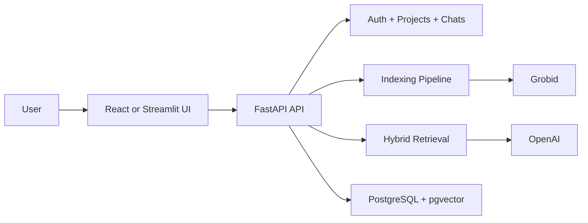

# TalkToPDF — AI chat over PDFs with citations

A self-hosted RAG application that turns a PDF into a searchable chat workspace, with grounded answers, source citations, and optional Streamlit or React frontends.

## Demo

Coming soon: a short walkthrough showing PDF upload, indexing, chat, and citation inspection in the current UI.

## Why This Project

Many teams already have valuable information inside PDFs, but that information is slow to search and hard to reuse in day-to-day work.

TalkToPDF is built to turn those static documents into a practical question-answering interface that can be deployed for internal teams or adapted for client work.

## What It Solves

Instead of manually scanning long PDFs, users can:

- upload a document into a dedicated project
- index it for retrieval
- ask natural-language questions
- get answers backed by citations from the source document
- keep persistent chat history per project

## Use Cases

- Legal and compliance document review
- Research paper exploration
- Internal knowledge assistants for manuals and SOPs
- Client-specific document Q&A portals
- Private, self-hosted AI assistants over sensitive PDFs

## What You Can Do

- Create a project around a PDF
- Index the document asynchronously
- Chat with streaming answers
- Review cited source chunks behind each answer
- Manage multiple chats inside one project
- Use either the API, Streamlit UI, or React UI

## Key Features

- Structure-aware PDF extraction with Grobid
- Hybrid retrieval using pgvector similarity search plus PostgreSQL full-text search
- Query rewriting for better retrieval across chat history
- Optional reranking before final answer generation
- Streaming replies with stored citations and response metrics
- JWT-based authentication
- React frontend for a more polished client-facing workspace
- Streamlit frontend for a simple lightweight interface

## Design Highlights

- **Grounded answers, not generic chat**  
  Replies are built from retrieved document chunks and stored with citations for later review.

- **Built for real document workflows**  
  Projects, chats, indexing state, and uploaded files are persisted instead of living in a temporary demo session.

- **Retrieval quality over toy behavior**  
  The system combines vector search, full-text search, query rewriting, and reranking to improve answer quality.

- **Client-ready UI options**  
  The same backend can serve API consumers, a quick Streamlit app, or a React frontend.

## Architecture at a Glance

- FastAPI backend for auth, projects, indexing, and chat
- PostgreSQL with `pgvector` and full-text search for retrieval
- Grobid for structure-aware PDF extraction
- OpenAI models for embeddings, rewriting, reranking, and answers
- Optional Streamlit and React frontends



## Tech Stack

- Python
- FastAPI
- Streamlit
- React + Vite + TypeScript
- PostgreSQL
- pgvector
- SQLAlchemy + Alembic
- OpenAI API
- Grobid
- Docker


## Quickstart with Docker Compose

Prerequisites:

- Docker
- Docker Compose
- OpenAI API key

```bash
# 1. Create the Docker env file
cp .env.docker.example .env.docker

# 2. Edit .env.docker and set OPENAI_API_KEY

# 3. Start the backend stack
docker compose up --build
```

Access services:

- FastAPI API: `http://localhost:8000`
- FastAPI docs: `http://localhost:8000/docs`
- Health check: `http://localhost:8000/health`

### Optional Streamlit UI with Docker

```bash
docker compose --profile streamlit up --build
```

Streamlit URL:

- Streamlit UI: `http://localhost:8501`

### Optional React UI with Docker

```bash
docker compose --profile react up --build
```

React URL:

- React UI: `http://localhost:5173`

### Optional Both UIs with Docker

```bash
docker compose --profile streamlit --profile react up --build
```

Notes:

- The Docker image tag used by the compose services is `aminook/talktopdf:0.2.0`
- The compose stack starts FastAPI, PostgreSQL with `pgvector`, and Grobid
- The Streamlit frontend is available through the `streamlit` profile
- The React frontend is available through the `react` profile
- The container runs Alembic migrations before starting the API
- There is no documented `docker compose -f docker-compose-dev.yml` flow anymore

## Local Development

Use Docker for infrastructure, then run the app locally.

```bash
# 1. Start PostgreSQL and Grobid
docker compose up -d db grobid

# 2. Create local env
cp .env.example .env

# 3. Edit .env and set OPENAI_API_KEY

# 4. Install Python dependencies
uv sync --dev

# 5. Run database migrations
uv run alembic upgrade head
```

### Run the Backend

```bash
uv run uvicorn talk_to_pdf.backend.app.main:app --reload
```

Backend URLs:

- API: `http://localhost:8000`
- Docs: `http://localhost:8000/docs`

### Run the Streamlit UI

```bash
uv run streamlit run src/talk_to_pdf/frontend/streamlit_app/main.py
```

Streamlit URL:

- Streamlit UI: `http://localhost:8501`

The Streamlit app reads `API_BASE_URL`, which defaults to `http://127.0.0.1:8000/api/v1`.

### Run the React UI

Create `src/talk_to_pdf/frontend/react/.env` with:

```bash
VITE_API_BASE_URL=http://127.0.0.1:8000/api/v1
```

Then run:

```bash
npm install
npm run dev
```

React URL:

- React UI: `http://localhost:5173`

Package scripts:

- `npm run dev`
- `npm run build`
- `npm run preview`

### Run Tests

```bash
uv run pytest
```

## Configuration

Main environment variables:

- `OPENAI_API_KEY` — required for embeddings, query rewriting, reranking, and answer generation
- `SQLALCHEMY_DATABASE_URL` — PostgreSQL connection string
- `GROBID_URL` — Grobid service URL
- `FILE_STORAGE_DIR` — local storage path for uploaded PDFs
- `API_BASE_URL` — API base URL used by Streamlit
- `VITE_API_BASE_URL` — API base URL used by React

See `.env.example` and `.env.docker.example` for the full current configuration.

## Design Decisions

- **One primary PDF per project**: the current workflow is centered around a single uploaded document for each project
- **Hybrid retrieval**: vector similarity and PostgreSQL full-text search are merged before answer generation
- **Async indexing**: PDF extraction and embedding run as background indexing jobs
- **Persistent chat and citations**: answers, chats, and citation metadata are stored for later review
- **Frontend flexibility**: React and Streamlit sit on top of the same FastAPI backend

## Roadmap

- [ ] Demo video
- [ ] Hosted demo
- [ ] Multi-document projects
- [ ] Cloud object storage support
- [ ] Additional model providers
- [x] React frontend
- [x] Streaming answers with citations

## Portfolio Note

This project is meant to show practical RAG engineering beyond a basic chatbot: document ingestion, hybrid retrieval, answer grounding, async indexing, persistent state, and multiple frontend options on top of one backend platform.
